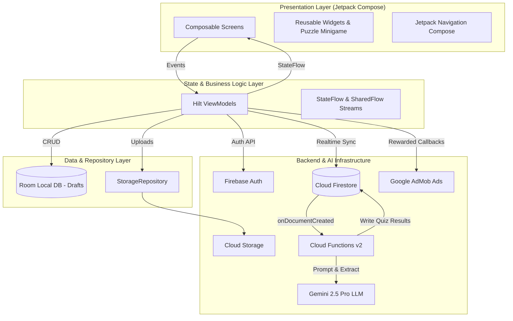

# 📚 KAL — Read • Learn • Earn

[](https://developer.android.com)
[](https://kotlinlang.org/)
[](https://developer.android.com/jetpack/compose)
[](https://dagger.dev/hilt/)
[](https://developer.android.com/training/data-storage/room)
[](https://firebase.google.com/)
[](https://deepmind.google/technologies/gemini/)
[](https://admob.google.com/)
[](LICENSE)

> **KAL** is a modern, gamified educational reading platform for Android that combines digital book consumption, AI-generated comprehension assessments, an in-app reward economy, and community publishing.

---

## 🌟 Overview

Reading educational and literary material often suffers from low engagement and retention. Readers consume static content without immediate comprehension feedback or incentivization.

**KAL (Read • Learn • Earn)** transforms the traditional reading experience into an interactive, gamified journey:
1. **Read**: Stream and read curated digital books and community literature through a fluid in-app PDF reader.
2. **Learn**: Earn rewards by passing automated, dynamically generated quizzes tailored to the exact pages read, powered on-the-fly by **Google Gemini 2.5 Pro**.
3. **Earn**: Accumulate KAL coins to unlock premium literature, fund creative writing privileges, and engage with community-authored works.

---

## 🎯 The Problem

- **Passive Consumption**: Readers frequently read books passively without active recall, resulting in low comprehension and poor retention.
- **Static Testing**: Traditional educational apps rely on static, pre-written question banks that do not adapt to individual reading milestones.
- **Lack of Incentives**: Young readers lack tangible reward feedback loops that encourage consistent daily reading habits.
- **Barriers for Indie Authors**: Aspiring writers and authors have limited mobile-first platforms to draft offline, publish directly, and promote their books to targeted readers.

---

## 💡 The Solution

KAL introduces an end-to-end reading, learning, and earning ecosystem:

- **AI-Driven Comprehension Milestones**: Every 10 pages read triggers a dynamically generated quiz extracted specifically from the freshly read text slice using serverless Google Gemini Pro.
- **Zero-Wait Engagement**: While the AI parses PDF text and crafts unique multiple-choice questions, readers solve an interactive 15-puzzle minigame.
- **Gamified Economy**: Scoring high on quizzes rewards users with KAL coins, creating a self-sustaining cycle where reading pays for unlocking new books and creative publishing tools.
- **Dual-Role Ecosystem**: Seamless support for both **Readers** and **Authors**, offering author profiles, promotional book cards, offline Room draft management, and transactional cloud publishing.

---

## ✨ Implemented Features

### 📖 1. Digital PDF Reading Engine
- High-performance, streaming PDF reader with cached local storage.
- Real-time progress synchronization to Cloud Firestore (`currentPage`, `totalPages`, `progressPercent`).
- Intelligent milestone tracking that activates quiz prompts at configurable page intervals.
- Safety bounds that prevent backward navigation past passed quiz checkpoints.

### 🧠 2. AI-Powered Dynamic Quiz Pipeline
- Serverless event-driven architecture triggered on Firestore `quizRequests`.
- Cloud Functions extract textual content from precise PDF page ranges via `pdf-parse`.
- Prompts **Google Gemini 2.5 Pro** to produce 5 unique, contextual Multiple-Choice Questions (MCQs) with single-correct-answer validation.
- Interactive 45-second countdown timer per question with real-time score computation.

### 🎮 3. Interactive Loading Minigames
- Extensible `PuzzleRouter` component that randomly presents engaging puzzles during AI question generation.
- Fully functional **15-Puzzle Sliding Game** (`NumberSlidePuzzle`) with algorithmic random shuffle ensuring solvability.

### 💰 4. Gamified Coin Wallet & Economy
- Real-time Firestore snapshot listeners on user coin balances (`totalPoints`).
- Atomic batch operations and Cloud Function transactions for deducting and rewarding coins.
- Monetization with **Google AdMob Rewarded Video Ads** before quiz challenges.

### ✍️ 5. Creative Writing & Offline Drafts
- Local draft creation and autosave using **Room Database** (`AppDatabase`, `DraftDao`, `Draft`).
- Transactional story publishing through Cloud Functions with coin balance deduction (50 coins).
- Community feed with real-time genre filtering (`Short story`, `Poetry`, `Novels`, `Essays`), sorting by popularity or recency, and optimistic like transactions.

### 📢 6. Author Portal & Book Promotions
- Dedicated author onboarding with pen names and author biographies.
- Promotional post creator (`CreatePostScreen`) supporting cloud image uploads via `StorageRepository` and external purchasing links.
- Community promotion feed (`PromotionsFeedScreen`) displaying author cards and book synopses.

### 🔐 7. Authentication & User Management
- Firebase Authentication supporting Email/Password and Google Sign-In credentials.
- Email verification verification flows (`VerifyEmailScreen`) and self-service password recovery (`ForgotPasswordScreen`).
- Role-based navigation differentiating Readers from Authors.

---

## 🏗️ Architecture

KAL is built using **Clean Architecture** with the **MVI/MVVM** pattern and **Unidirectional Data Flow (UDF)**:



Detailed architecture breakdowns and sequence flows are documented in [`docs/ARCHITECTURE.md`](file:///e:/kal/docs/ARCHITECTURE.md).

---

## 🛠️ Technology Stack

| Layer / Subsystem | Technology / Library | Version | Purpose |
| :--- | :--- | :--- | :--- |
| **Language** | Kotlin | `1.9.23` | Core Android application development |
| **UI Framework** | Jetpack Compose (BOM) | `2024.05.00` | Modern declarative user interface |
| **Design System** | Material Design 3 | `1.2.x` | Material design components, typography, color themes |
| **Architecture** | MVVM / MVI + UDF | Jetpack Lifecycle `2.8.0` | Separation of concerns and reactive state |
| **Dependency Injection** | Dagger Hilt | `2.51.1` | Compile-time dependency injection |
| **Local Database** | Room SQLite | `2.6.1` | Local offline caching for creative writing drafts |
| **Cloud Database** | Cloud Firestore | Firebase BOM `33.1.1` | Real-time NoSQL cloud database |
| **Authentication** | Firebase Auth | Firebase BOM `33.1.1` | Email/Password & Google OAuth |
| **Cloud Storage** | Firebase Storage | Firebase BOM `33.1.1` | PDF files, author book covers, media |
| **Serverless Backend** | Firebase Cloud Functions | Node.js 22 / TypeScript | Serverless triggers and atomic business logic |
| **Artificial Intelligence**| Google Gemini 2.5 Pro | `@google/generative-ai` | Context-aware dynamic quiz generation from PDF text |
| **Monetization** | Google Mobile Ads (AdMob) | `23.1.0` | Rewarded video ads for quiz unlocking |
| **Image Loading** | Coil Compose | `2.6.0` | Asynchronous image loading and memory caching |
| **Network Client** | Ktor Client Android | `2.3.9` | High-efficiency PDF streaming and byte downloading |
| **PDF Processing** | `pdf-parse` (Backend) | `1.1.1` | Targeted page-range text extraction in Cloud Functions |

---

## 📁 Project Structure

```
KAL-Read-Learn-Android/
├── app/
│   ├── src/
│   │   ├── androidTest/              # Instrumentation tests
│   │   ├── test/                     # Unit tests
│   │   └── main/
│   │       ├── AndroidManifest.xml   # Application manifest, permissions, AdMob ID
│   │       ├── java/com/example/kal/
│   │       │   ├── KalApplication.kt # Hilt application entrypoint
│   │       │   ├── MainActivity.kt   # Single Activity host
│   │       │   ├── data/             # Domain & Data Models (Book, User, Writing, Post, Quiz)
│   │       │   │   ├── local/        # Room Database, DAO, and Draft entity
│   │       │   │   └── repository/   # Firebase StorageRepository
│   │       │   ├── di/               # Hilt Modules (FirebaseModule, DatabaseModule)
│   │       │   └── ui/               # Jetpack Compose Screens & ViewModels
│   │       │       ├── AppNavigation.kt
│   │       │       ├── auth/         # Login, Signup, AuthorSignup, ForgotPassword, VerifyEmail
│   │       │       ├── create_post/  # Author promotional ad creator
│   │       │       ├── create_writing/# Creative story writer & Room draft editor
│   │       │       ├── details/      # Book details & reviews
│   │       │       ├── explore/      # Community writings feed & genre filter
│   │       │       ├── main/         # Home screen & search
│   │       │       ├── my_posts/     # Author-specific published ads
│   │       │       ├── my_writings/  # User saved drafts & publications
│   │       │       ├── navigation/   # Bottom navigation bar
│   │       │       ├── profile/      # User profile, role badges, resume reading
│   │       │       ├── promotions_feed/ # Author promotional feed
│   │       │       ├── quiz/         # Quiz flow, timer, score result, & minigame puzzle
│   │       │       │   └── components/ # NumberSlidePuzzle & PuzzleRouter
│   │       │       ├── reading/      # PDF reader & progress tracker
│   │       │       ├── theme/        # Material 3 Color, Theme, Type definitions
│   │       │       └── wallet/       # KAL Coin balance & transaction wallet
│   │       └── res/                  # Drawables, mipmaps, strings, XML configs
│   ├── build.gradle.kts              # App-level build configuration
│   └── google-services.json.example  # Template for Firebase client configuration
│
├── functions/                        # Serverless Firebase Cloud Functions (TypeScript)
│   ├── src/
│   │   └── index.ts                  # generateQuiz, unlockWritingFeature, publishWriting
│   ├── .env.example                  # Template for Gemini API key configuration
│   ├── package.json
│   └── tsconfig.json
│
├── docs/                             # Engineering Documentation
│   ├── ARCHITECTURE.md               # Detailed architecture diagrams & data flows
│   └── SETUP.md                      # Complete developer setup & build guide
│
├── .gitignore                        # Strict rules excluding secrets, build, and IDE artifacts
├── build.gradle.kts                  # Project-level build configuration
├── settings.gradle.kts               # Module and repository management
├── gradle.properties                 # Gradle JVM memory and AndroidX flags
├── local.properties.example          # Safe template for Android SDK location
├── LICENSE                           # MIT License
└── README.md
```

---

## 🚀 Quick Setup & Build

### Prerequisites
- **JDK 17** (Eclipse Adoptium OpenJDK 17 recommended)
- **Android Studio** Hedgehog (2023.1.1) or newer
- **Android SDK 34** (Android 14)

### Build & Run
```powershell
# 1. Clone the repository
git clone https://github.com/YOUR_USERNAME/KAL-Read-Learn-Android.git
cd KAL-Read-Learn-Android

# 2. Configure SDK path
Copy-Item local.properties.example local.properties

# 3. Compile Kotlin and verify build
$env:JAVA_HOME = "C:\Program Files\Eclipse Adoptium\jdk-17.0.20.101-hotspot"
.\gradlew.bat assembleDebug
```

For complete instructions including Firebase setup, Cloud Functions deployment, and Gemini API keys, see [`docs/SETUP.md`](file:///e:/kal/docs/SETUP.md).

---

## 🔐 Security & Clean Repository Policy

- **No Secrets in Source Control**: All live API keys, Gemini tokens, private keystores, and local SDK paths are strictly excluded via [`.gitignore`](file:///e:/kal/.gitignore).
- **Client Configuration Protection**: Client Firebase configuration templates are provided safely via [`app/google-services.json.example`](file:///e:/kal/app/google-services.json.example).
- **Serverless API Shielding**: Gemini AI API keys operate solely within the secure Firebase Cloud Functions execution environment.

---

## ⚠️ Known Limitations

1. **Active Internet Required for AI Quiz**: The dynamic quiz generation requires an active network connection to trigger Cloud Functions and query Gemini Pro.
2. **Paid Firebase Plan Requirement**: Firebase Cloud Functions making outbound calls to the Google Gemini API require the Firebase project to be on the Blaze (pay-as-you-go) billing plan.
3. **Single Active Book Offline**: While creative writing drafts are fully stored offline via Room SQLite, PDF books are cached individually on initial access.

---

## 🚀 Future Improvements

- [ ] **EPUB & Comic Support**: Extend reader engine beyond PDF to support reflowable EPUB format and graphic novels.
- [ ] **Offline Quiz Model**: Integrate on-device LiteRT / Gemini Nano for offline question synthesis.
- [ ] **Audiobook Narration**: Text-to-speech integration with synchronized sentence highlighting.
- [ ] **Expanded Puzzle Suite**: Add Color Sequence (Memory) and Quick Tap (Reaction) puzzle variants to `PuzzleRouter`.
- [ ] **Author Royalties Payout**: Direct monetization gateway enabling authors to convert KAL coin tips into real-world disbursements.

---

## 👨‍💻 Author

**Abhimanyu T**  
*Master of Computer Applications (MCA)*  
*Android & Cloud Software Engineer*
