# 📚 KAL — Read • Learn • Earn

[](https://developer.android.com)
[](https://kotlinlang.org/)
[](https://developer.android.com/jetpack/compose)
[](https://dagger.dev/hilt/)
[](https://developer.android.com/training/data-storage/room)
[](https://firebase.google.com/)
[](https://deepmind.google/technologies/gemini/)
[](https://admob.google.com/)
[](LICENSE)

> **KAL** is a modern, gamified educational reading platform for Android that combines digital book consumption, AI-generated comprehension assessments, an in-app reward economy, and community publishing.

---

## 🌟 Overview

Reading educational and literary material often suffers from low engagement and retention. Readers consume static content without immediate comprehension feedback or incentivization.

**KAL (Read • Learn • Earn)** transforms the traditional reading experience into an interactive, gamified journey:
1. **Read**: Stream and read curated digital books and community literature through a fluid in-app PDF reader.
2. **Learn**: Earn rewards by passing automated, dynamically generated quizzes tailored to the exact pages read, powered on-the-fly by **Google Gemini 2.5 Pro**.
3. **Earn**: Accumulate KAL coins to unlock premium literature, fund creative writing privileges, and engage with community-authored works.

---

## 📱 Application Showcase

| Login & Onboarding | User Home & Search | Book Details |
| :---: | :---: | :---: |
| 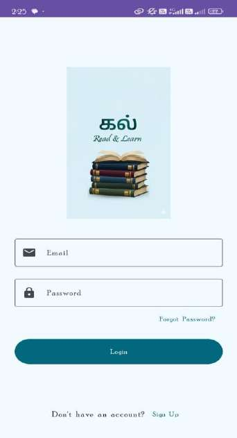 | 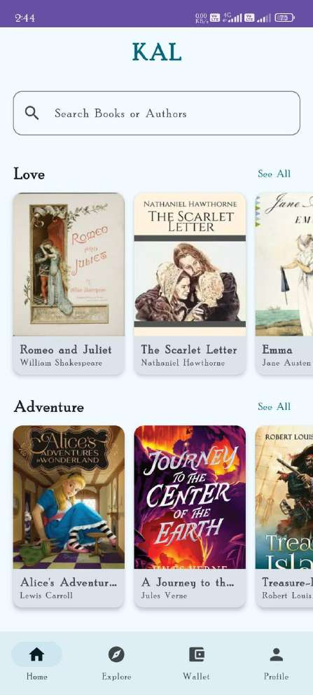 | 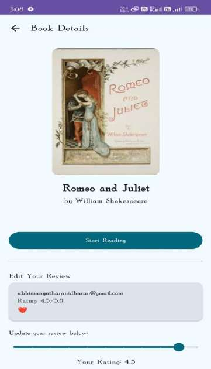 |
| **Login & Auth** | **Catalog & Search** | **Book Info & Reviews** |

| PDF Book Reading | Loading Minigame | AI Dynamic Quiz |
| :---: | :---: | :---: |
| 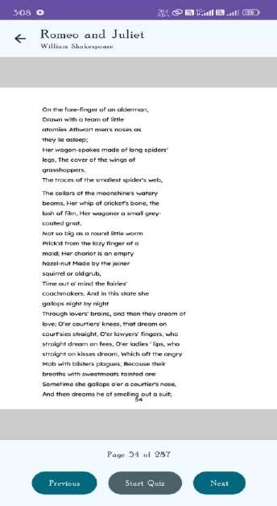 | 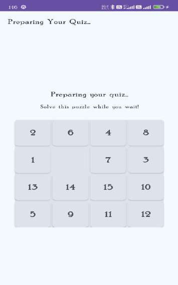 | 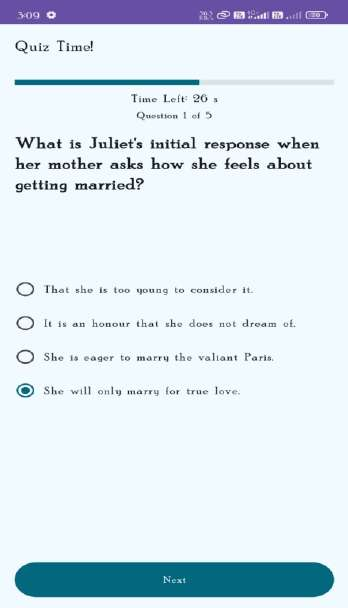 |
| **Streamed Reader** | **15-Puzzle Slider** | **Gemini AI MCQs** |

| Quiz Reward Result | Story Editor & Drafts | Community Literature |
| :---: | :---: | :---: |
| 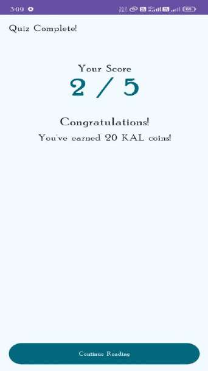 | 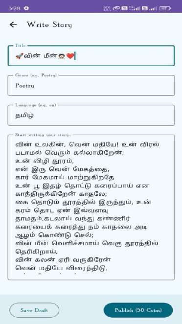 | 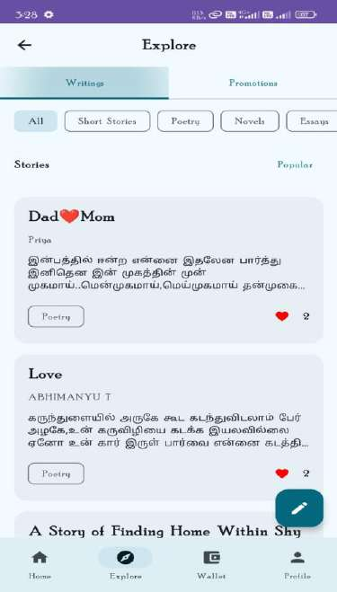 |
| **Coin Reward Summary** | **Room Offline Editor** | **Genre Feed & Likes** |

| Author Promotion Card | Coin Wallet (Vault) | User & Author Profile |
| :---: | :---: | :---: |
| 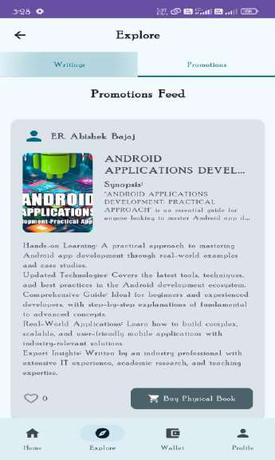 | 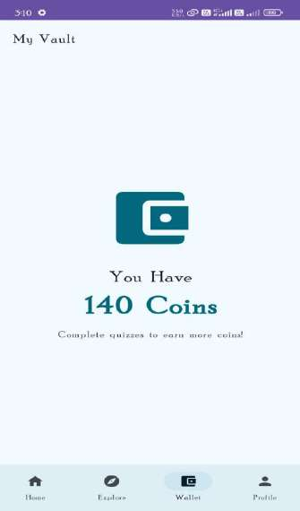 | 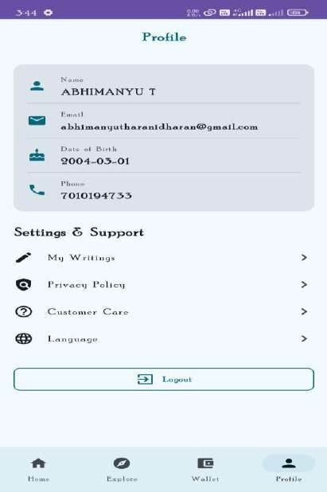 |
| **Book Ad Syndicate** | **Balance & Transactions** | **History & Roles** |

*All 15 application screens are cataloged with source references in [`docs/VISUAL-DOCUMENTATION.md`](docs/VISUAL-DOCUMENTATION.md).*

---

## 🎯 The Problem & 💡 The Solution

- **Passive Reading**: Readers frequently read books without active recall, resulting in low comprehension and poor retention.
  - *KAL's Solution*: Automatically generates a 5-question comprehension quiz derived from the exact 10-page slice read using serverless **Google Gemini Pro**.
- **Waiting Friction**: AI generation over large texts can introduce delay.
  - *KAL's Solution*: Integrates an algorithmic **15-Puzzle Sliding Minigame** (`NumberSlidePuzzle`) that keeps readers actively engaged while the quiz compiles.
- **Lack of Tangible Incentives**: Learners lack immediate feedback loops.
  - *KAL's Solution*: Correct answers award **10 KAL Coins per point**, which can be spent to unlock premium books and acquire author publishing rights.
- **Barriers for Indie Writers**: Creative writers have limited mobile-first platforms to draft and publish.
  - *KAL's Solution*: Provides a local **Room SQLite** offline draft manager with transactional cloud publishing to a community feed.

---

## 🏗️ Architecture & Workflow

KAL follows **Clean Architecture** with **MVVM/MVI** and **Unidirectional Data Flow (UDF)**.

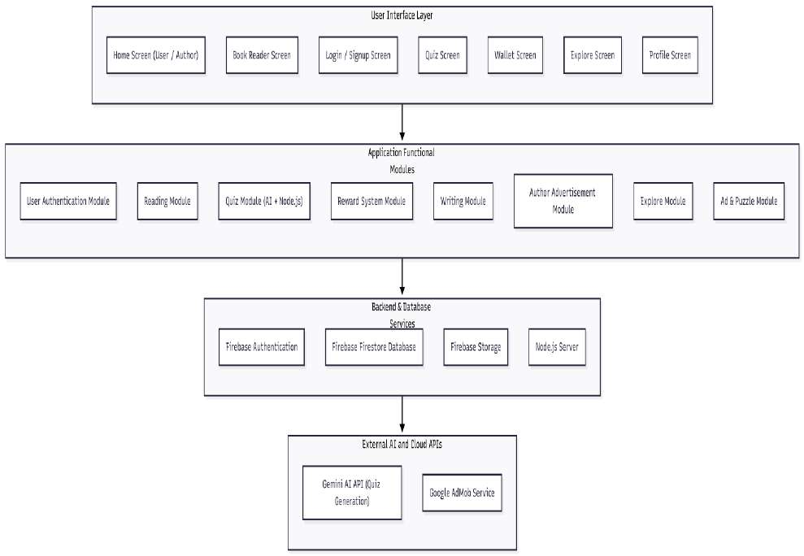

### Core System Workflow
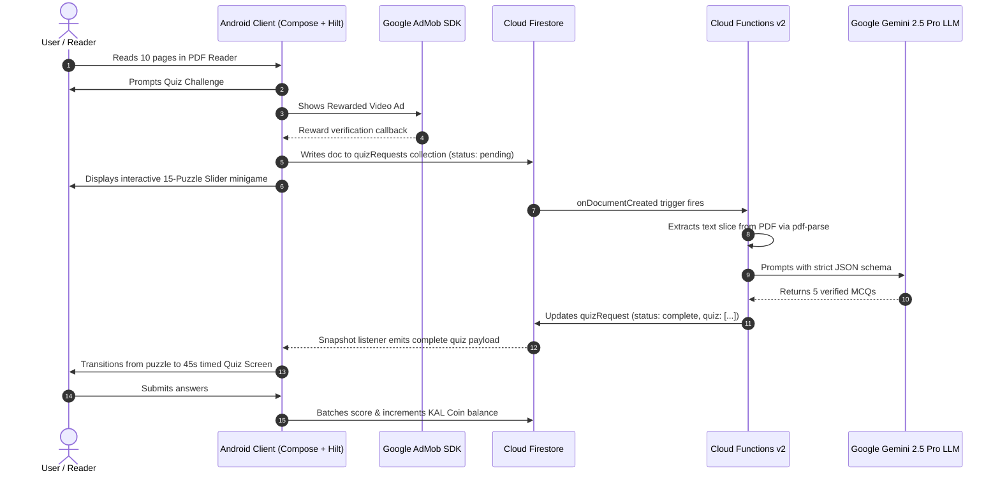

Detailed technical workflows and ER schemas are documented in [`docs/ARCHITECTURE.md`](docs/ARCHITECTURE.md) and [`docs/VISUAL-DOCUMENTATION.md`](docs/VISUAL-DOCUMENTATION.md).

---

## 🛠️ Technology Stack

| Layer / Subsystem | Technology / Library | Version | Verified Role |
| :--- | :--- | :--- | :--- |
| **Language** | Kotlin | `1.9.23` | Core Android application development |
| **UI Framework** | Jetpack Compose (BOM) | `2024.05.00` | Modern declarative user interface |
| **Design System** | Material Design 3 | `1.2.x` | Material design components, typography, color themes |
| **Architecture** | MVVM / MVI + UDF | Jetpack Lifecycle `2.8.0` | Separation of concerns and reactive state |
| **Dependency Injection** | Dagger Hilt | `2.51.1` | Compile-time dependency injection |
| **Local Database** | Room SQLite | `2.6.1` | Local offline caching for creative writing drafts |
| **Cloud Database** | Cloud Firestore | Firebase BOM `33.1.1` | Real-time NoSQL cloud database |
| **Authentication** | Firebase Auth | Firebase BOM `33.1.1` | Email/Password & Google OAuth |
| **Cloud Storage** | Firebase Storage | Firebase BOM `33.1.1` | PDF files, author book covers, media |
| **Serverless Backend** | Firebase Cloud Functions | Node.js 22 / TypeScript | Serverless triggers and atomic business logic |
| **Artificial Intelligence**| Google Gemini 2.5 Pro | `@google/generative-ai` | Context-aware dynamic quiz generation from PDF text |
| **Monetization** | Google Mobile Ads (AdMob) | `23.1.0` | Rewarded video ads for quiz unlocking |
| **Image Loading** | Coil Compose | `2.6.0` | Asynchronous image loading and memory caching |
| **Network Client** | Ktor Client Android | `2.3.9` | High-efficiency PDF streaming and byte downloading |
| **PDF Processing** | `pdf-parse` (Backend) | `1.1.1` | Targeted page-range text extraction in Cloud Functions |

---

## 📁 Project Structure

```
KAL-Read-Learn-Android/
├── app/
│   ├── src/
│   │   ├── androidTest/              # Instrumentation tests
│   │   ├── test/                     # Unit tests
│   │   └── main/
│   │       ├── AndroidManifest.xml   # Application manifest, permissions, AdMob ID
│   │       ├── java/com/example/kal/
│   │       │   ├── KalApplication.kt # Hilt application entrypoint
│   │       │   ├── MainActivity.kt   # Single Activity host
│   │       │   ├── data/             # Domain & Data Models (Book, User, Writing, Post, Quiz)
│   │       │   │   ├── local/        # Room Database, DAO, and Draft entity
│   │       │   │   └── repository/   # Firebase StorageRepository
│   │       │   ├── di/               # Hilt Modules (FirebaseModule, DatabaseModule)
│   │       │   └── ui/               # Jetpack Compose Screens & ViewModels
│   │       │       ├── AppNavigation.kt
│   │       │       ├── auth/         # Login, Signup, AuthorSignup, ForgotPassword, VerifyEmail
│   │       │       ├── create_post/  # Author promotional ad creator
│   │       │       ├── create_writing/# Creative story writer & Room draft editor
│   │       │       ├── details/      # Book details & reviews
│   │       │       ├── explore/      # Community writings feed & genre filter
│   │       │       ├── main/         # Home screen & search
│   │       │       ├── my_posts/     # Author-specific published ads
│   │       │       ├── my_writings/  # User saved drafts & publications
│   │       │       ├── navigation/   # Bottom navigation bar
│   │       │       ├── profile/      # User profile, role badges, resume reading
│   │       │       ├── promotions_feed/ # Author promotional feed
│   │       │       ├── quiz/         # Quiz flow, timer, score result, & minigame puzzle
│   │       │       │   └── components/ # NumberSlidePuzzle & PuzzleRouter
│   │       │       ├── reading/      # PDF reader & progress tracker
│   │       │       ├── theme/        # Material 3 Color, Theme, Type definitions
│   │       │       └── wallet/       # KAL Coin balance & transaction wallet
│   │       └── res/                  # Drawables, mipmaps, strings, XML configs
│   ├── build.gradle.kts              # App-level build configuration
│   └── google-services.json.example  # Template for Firebase client configuration
│
├── functions/                        # Serverless Firebase Cloud Functions (TypeScript)
│   ├── src/
│   │   └── index.ts                  # generateQuiz, unlockWritingFeature, publishWriting
│   ├── .env.example                  # Template for Gemini API key configuration
│   ├── package.json
│   └── tsconfig.json
│
├── docs/                             # Engineering Documentation
│   ├── KAL-Project-Report.pdf        # Official academic project report (46 pages)
│   ├── ARCHITECTURE.md               # Detailed architecture diagrams & data flows
│   ├── SETUP.md                      # Complete developer setup & build guide
│   ├── VISUAL-DOCUMENTATION.md       # Extracted diagrams & screenshot index
│   ├── DOCUMENTATION-AUDIT.md        # Source vs Report consistency verification
│   └── diagrams/                     # Extracted technical diagrams & flowcharts
│
├── screenshots/                      # Extracted application UI screens
├── .gitignore                        # Strict rules excluding secrets, build, and IDE artifacts
├── build.gradle.kts                  # Project-level build configuration
├── settings.gradle.kts               # Module and repository management
├── gradle.properties                 # Gradle JVM memory and AndroidX flags
├── local.properties.example          # Safe template for Android SDK location
├── LICENSE                           # MIT License
└── README.md
```

---

## 🚀 Quick Setup & Build

### Prerequisites
- **JDK 17** (Eclipse Adoptium OpenJDK 17 recommended)
- **Android Studio** Hedgehog (2023.1.1) or newer
- **Android SDK 34** (Android 14)

### Build & Run
```powershell
# 1. Clone the repository
git clone https://github.com/Abhi-wizard/KAL-Read-Learn-Android.git
cd KAL-Read-Learn-Android

# 2. Configure SDK path
Copy-Item local.properties.example local.properties

# 3. Compile Kotlin and verify build
$env:JAVA_HOME = "C:\Program Files\Eclipse Adoptium\jdk-17.0.20.101-hotspot"
.\gradlew.bat assembleDebug
```

For complete instructions including Firebase setup, Cloud Functions deployment, and Gemini API keys, see [`docs/SETUP.md`](docs/SETUP.md).

---

## 📚 Project Documentation Index

- 📄 **[Official Project Report](docs/KAL-Project-Report.pdf)**: Complete 46-page academic project documentation submitted for Master of Computer Applications (MCA) at Bharathiar University (November 2025).
- 🏗️ **[System Architecture Guide](docs/ARCHITECTURE.md)**: In-depth technical architecture, module interactions, and sequence diagrams.
- 🛠️ **[Developer Setup & Run Guide](docs/SETUP.md)**: Complete guide to configuring Firebase, Cloud Functions, and building the Android application.
- 🖼️ **[Visual Asset Documentation](docs/VISUAL-DOCUMENTATION.md)**: Catalog of all 8 system diagrams and 15 UI screenshots with source report references.
- 🔍 **[Source & Report Consistency Audit](docs/DOCUMENTATION-AUDIT.md)**: Cross-reference audit verifying codebase implementations against the academic report.

---

## 🔐 Security Policy

- **No Secrets in Source Control**: All live API keys, Gemini tokens, private keystores, and local SDK paths are strictly excluded via [`.gitignore`](.gitignore).
- **Client Configuration Protection**: Client Firebase configuration templates are provided safely via [`app/google-services.json.example`](app/google-services.json.example).
- **Serverless API Shielding**: Gemini AI API keys operate solely within the secure Firebase Cloud Functions execution environment.

---

## ⚠️ Known Limitations

1. **Active Internet Required for AI Quiz**: Dynamic quiz generation requires an active network connection to trigger Cloud Functions and query Gemini Pro.
2. **Paid Firebase Plan Requirement**: Firebase Cloud Functions making outbound calls to the Google Gemini API require the Firebase project to be on the Blaze (pay-as-you-go) billing plan.
3. **Single Active Book Offline**: While creative writing drafts are fully stored offline via Room SQLite, PDF books are cached individually on initial access.

---

## 👨‍💻 Author

**Abhimanyu T**  
*Master of Computer Applications (MCA)*  
*Department of Computer Applications, Bharathiar University, Coimbatore*  
*GitHub*: [@Abhi-wizard](https://github.com/Abhi-wizard)
