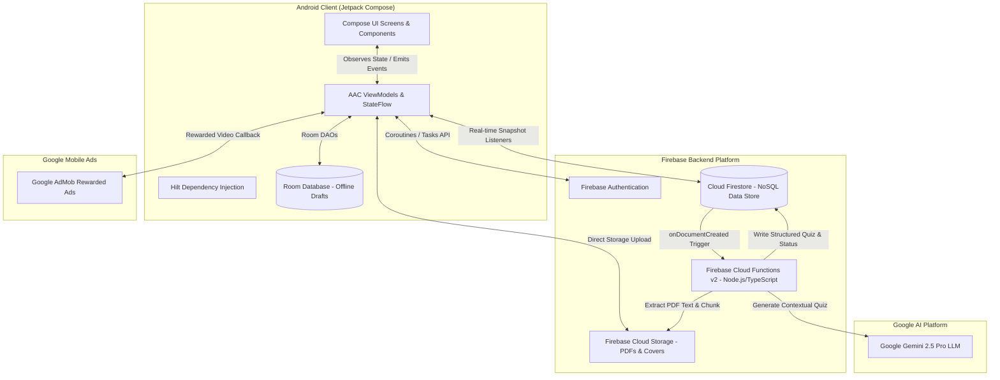
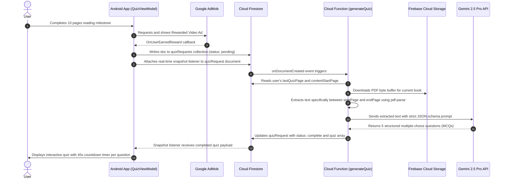

# 🏗️ KAL — Architecture Documentation

This document provides a comprehensive technical overview of the architecture, design patterns, data flows, and subsystem integrations implemented in the **KAL — Read • Learn • Earn** Android platform.

---

## 1. High-Level System Architecture

KAL is built as a modern, reactive, offline-capable Android application adhering to Clean Architecture principles, MVVM (Model-View-ViewModel) with unidirectional data flow (UDF), and serverless cloud integration.

---

## 2. Layered Architecture

### A. Presentation Layer (UI & Jetpack Compose)
- **Declarative UI**: 100% Jetpack Compose with Material 3 design tokens and theme typography.
- **Unidirectional Data Flow (UDF)**: ViewModels expose immutable `StateFlow<UiState>` and `SharedFlow<Event>` streams. Composable screens observe state via `collectAsState()` and dispatch user actions via ViewModel functions.
- **Navigation**: Single Activity architecture (`MainActivity`) hosting `NavHost` with type-safe routing arguments via Jetpack Navigation Compose.
- **Splash Screen API**: Android 12+ native splash screen (`installSplashScreen()`) integrated with application entry.

### B. Dependency Injection Layer (Dagger Hilt)
- **`@HiltAndroidApp`**: Application-level dependency graph lifecycle management (`KalApplication`).
- **`FirebaseModule`**: Provides singleton instances of `FirebaseAuth`, `FirebaseFirestore`, `FirebaseStorage`, and `FirebaseFunctions`.
- **`DatabaseModule`**: Provides singleton instances of `AppDatabase` (Room) and `DraftDao`.
- **ViewModel Injection**: `@HiltViewModel` annotates all ViewModels, injecting DAOs, repositories, and Firebase services.

### C. Data & Local Persistence Layer
- **Room SQLite Database (`AppDatabase`)**:
  - `Draft` entity: Stores offline creative writings (`title`, `content`, `genre`, `language`).
  - `DraftDao`: Exposes reactive `Flow<List<Draft>>` queries for real-time local cache synchronization.
- **Firebase Firestore (Cloud NoSQL)**:
  - Multi-collection relational structure (`users`, `books`, `writings`, `posts`, `quizRequests`).
  - Subcollections: `users/{uid}/readingProgress/{bookId}`, `books/{bookId}/reviews/{uid}`.
- **Firebase Storage**:
  - Encapsulated by `StorageRepository` for uploading book covers and promotional media with unique UUIDs.

---

## 3. Core Feature Workflows & Data Pipelines

### Pipeline 1: AI-Powered Dynamic Quiz Generation
The quiz pipeline transforms static PDF reading material into an interactive educational experience using Google Gemini:

### Pipeline 2: Interactive Puzzle While AI Generates Quiz
To eliminate loading friction while the cloud function processes the PDF and queries Gemini, KAL displays an interactive minigame router (`PuzzleRouter`):
- **15-Puzzle Sliding Game (`NumberSlidePuzzle`)**: A fully interactive 4x4 numbered tile slider with algorithmic shuffle guaranteeing solvability.
- Seamlessly transitions to the quiz as soon as the Firestore snapshot listener receives the generated question set.

### Pipeline 3: Gamified Rewards & Wallet Economy
- **Quiz Completion**: Correct answers earn **10 KAL Coins per point** (e.g., 5/5 = 50 coins).
- **Atomic Transactions**: Coin updates use `FieldValue.increment()` within atomic Firestore batch operations to ensure database integrity.
- **Content Unlocking**:
  - Creative Writing feature unlock: 30 coins (handled via transactional Cloud Function `unlockWritingFeature`).
  - Story publication fee: 50 coins (handled via transactional Cloud Function `publishWriting`).
  - Paid Book access: Unlocked via `unlockBook` Cloud Function.

### Pipeline 4: Author Portal & Book Promotion System
- **Dual-Role Model**: Users can register as standard readers or **Authors**.
- **Promotions Feed (`PromotionsFeedScreen`)**: Authors can create rich promotional cards (`PostCard`) with synopsis, book cover uploads, and external e-commerce purchasing links.
- **Optimistic UI Updates**: Community likes on creative writings and author posts update the UI immediately, then commit to Firestore using transactional `FieldValue.arrayUnion` / `arrayRemove`.

---

## 4. Firestore Database Schema Design

| Collection / Path | Purpose | Key Fields |
| :--- | :--- | :--- |
| `users/{uid}` | User & Author Profiles | `uid`, `name`, `email`, `role`, `totalPoints`, `isWritingUnlocked`, `bio`, `recentlyReadBookId`, `profileImageUrl`, `createdAt` |
| `users/{uid}/readingProgress/{bookId}` | Per-book reading metrics | `bookId`, `currentPage`, `totalPages`, `progressPercent`, `lastQuizPage`, `lastQuizScore`, `lastQuizTakenAt`, `lastReadAt` |
| `books/{bookId}` | Library catalog | `id`, `title`, `author`, `descrption`, `coverImageUrl`, `pdfUrl`, `storagePath`, `genre`, `pageCount`, `contentStartPage`, `price` |
| `books/{bookId}/reviews/{uid}` | Book ratings & reviews | `userId`, `userEmail`, `rating`, `comment`, `timestamp` |
| `writings/{writingId}` | Community publications | `id`, `uid`, `authorName`, `title`, `content`, `genre`, `language`, `status`, `likesCount`, `likedBy[]`, `createdAt` |
| `posts/{postId}` | Author promotional ads | `id`, `authorId`, `authorPenName`, `bookTitle`, `bookSynopsis`, `bookCoverUrl`, `purchaseLink`, `authorComment`, `likesCount`, `likedBy[]`, `createdAt` |
| `quizRequests/{requestId}` | Serverless AI quiz queue | `uid`, `bookId`, `endPage`, `status`, `quiz[]`, `errorMessage`, `createdAt`, `processedAt` |

---

## 5. Security & Isolation Architecture

1. **Client-Side Secrets Free**: The Android application does NOT contain private service-account keys or Gemini API keys.
2. **Serverless Secret Storage**: The Gemini API key is maintained strictly inside the Firebase Cloud Functions runtime environment.
3. **Firestore Security Rules**: User document mutations and coin balance decrements are secured via Cloud Functions server transactions to prevent unauthorized client modifications.
4. **Git Isolation**: All local SDK paths (`local.properties`), IDE metadata (`.idea/`), build outputs (`build/`), and backend secrets (`.env`) are strictly excluded from version control.
