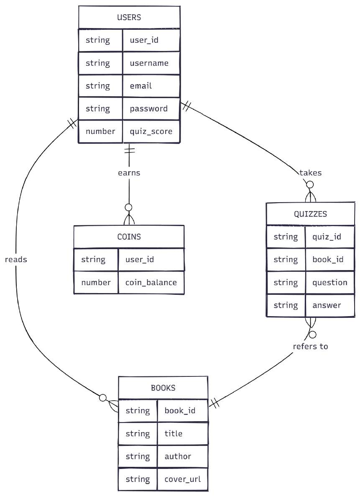

# 🖼️ KAL — Visual Documentation & Asset Index

This document provides a comprehensive index of all system architecture diagrams, database models, technical workflows, and user interface screenshots extracted directly from the official project documentation ([`KAL-Project-Report.pdf`](./KAL-Project-Report.pdf)).

---

## 🏗️ 1. Architecture & System Diagrams

| Asset | Source Ref | Description | Preview |
| :--- | :--- | :--- | :--- |
| **System Architecture** | Figure 1 (Page 20) | Multi-tier architecture showing Client (Android/Compose), Serverless Backend (Node.js/Cloud Functions), Firebase Services (Auth/Firestore/Storage), and Google Gemini AI | [View Image](./diagrams/architecture/system-architecture.jpg) |
| **Database Design** | Figure 2 (Page 21) | Entity relationship and NoSQL collection schemas across `users`, `books`, `writings`, `posts`, and `quizRequests` | [View Image](./diagrams/database/database-design.jpg) |

### System Architecture Preview

### Database Schema Preview

---

## 🔄 2. Technical Workflow Flowcharts

| Workflow | Source Ref | Process Description | File Path |
| :--- | :--- | :--- | :--- |
| **User Authentication** | Figure 3 (Page 23) | Login, Email verification, Role validation (Reader vs Author), and Google OAuth onboarding | [`diagrams/workflow/01-user-authentication-flowchart.jpg`](./diagrams/workflow/01-user-authentication-flowchart.jpg) |
| **Book Reading** | Figure 4 (Page 24) | PDF stream loading, local cache validation, page tracking, and quiz threshold trigger | [`diagrams/workflow/02-book-reading-flowchart.jpg`](./diagrams/workflow/02-book-reading-flowchart.jpg) |
| **Quiz Generation** | Figure 5 (Page 25) | Event trigger on Firestore `quizRequests`, PDF text slice extraction via `pdf-parse`, and Gemini AI prompt processing | [`diagrams/workflow/03-quiz-generation-flow.jpg`](./diagrams/workflow/03-quiz-generation-flow.jpg) |
| **Quiz Evaluation & Reward** | Figure 6 (Page 26) | Timer management, score calculation, and atomic coin increments | [`diagrams/workflow/04-quiz-evaluation-reward-flow.jpg`](./diagrams/workflow/04-quiz-evaluation-reward-flow.jpg) |
| **Writing & Publishing** | Figure 7 (Page 27) | Offline Room SQLite draft saving, 50-coin transactional validation, and Firestore public story publishing | [`diagrams/workflow/05-writing-publishing-flowchart.jpg`](./diagrams/workflow/05-writing-publishing-flowchart.jpg) |
| **Author Book Advertisement**| Figure 8 (Page 28) | Cover upload via StorageRepository, synopsis entry, and promotional feed syndication | [`diagrams/workflow/06-author-advertisement-flowchart.jpg`](./diagrams/workflow/06-author-advertisement-flowchart.jpg) |

---

## 📱 3. Application Screenshots (Extracted from Project Report)

### A. Authentication & Onboarding
| Screen | Source Ref | Description | File Path |
| :--- | :--- | :--- | :--- |
| **Login Screen** | Figure 9 (Page 35) | Email/Password login, Google Sign-in button, and navigation to signup/forgot password | [`screenshots/auth/01-login-screen.jpg`](../screenshots/auth/01-login-screen.jpg) |
| **User Sign Up** | Figure 10 (Page 35) | General reader registration form with validation and email verification prompt | [`screenshots/auth/02-user-signup-screen.jpg`](../screenshots/auth/02-user-signup-screen.jpg) |
| **Author Sign Up** | Figure 11 (Page 35) | Creator onboarding with pen name and author biography fields | [`screenshots/auth/03-author-signup-screen.jpg`](../screenshots/auth/03-author-signup-screen.jpg) |

### B. Core Navigation & Home
| Screen | Source Ref | Description | File Path |
| :--- | :--- | :--- | :--- |
| **User Home Screen** | Figure 12 (Page 36) | Curated book catalogue categorized by genre with real-time search filtering | [`screenshots/home/04-user-home-screen.jpg`](../screenshots/home/04-user-home-screen.jpg) |
| **Author Home Screen** | Figure 13 (Page 36) | Author dashboard displaying promotional management and reader engagement | [`screenshots/home/05-author-home-screen.jpg`](../screenshots/home/05-author-home-screen.jpg) |

### C. Reading & Learning Engine
| Screen | Source Ref | Description | File Path |
| :--- | :--- | :--- | :--- |
| **Book Details** | Figure 14 (Page 37) | Book synopsis, page count, price, user reviews, and start reading button | [`screenshots/reading/06-book-details-screen.jpg`](../screenshots/reading/06-book-details-screen.jpg) |
| **Book Reading Screen** | Figure 15 (Page 37) | Streamed PDF reader with page-by-page rendering and progress persistence | [`screenshots/reading/07-book-reading-screen.jpg`](../screenshots/reading/07-book-reading-screen.jpg) |
| **Quiz Screen** | Figure 16 (Page 37) | AI-generated multiple-choice questions with 45s countdown timer | [`screenshots/quiz/08-quiz-screen.jpg`](../screenshots/quiz/08-quiz-screen.jpg) |
| **Quiz Result Screen** | Figure 17 (Page 37) | Performance breakdown, score badge, and coin rewards earned summary | [`screenshots/quiz/09-quiz-result-screen.jpg`](../screenshots/quiz/09-quiz-result-screen.jpg) |
| **Puzzle Minigame** | Figure 22 (Page 39) | 15-puzzle sliding game keeping users engaged while Gemini AI generates questions | [`screenshots/quiz/14-puzzle-minigame-screen.jpg`](../screenshots/quiz/14-puzzle-minigame-screen.jpg) |

### D. Creative Writing & Author Promotion
| Screen | Source Ref | Description | File Path |
| :--- | :--- | :--- | :--- |
| **Writing Screen** | Figure 18 (Page 38) | Creative text editor supporting local Room SQLite drafting and cloud publishing | [`screenshots/writing/10-create-writing-screen.jpg`](../screenshots/writing/10-create-writing-screen.jpg) |
| **Explore (Writings)** | Figure 19 (Page 38) | Community literature feed with genre filter chips and interactive like buttons | [`screenshots/writing/11-explore-writings-screen.jpg`](../screenshots/writing/11-explore-writings-screen.jpg) |
| **Author Book Promotion**| Figure 20 (Page 38) | Author book advertisement card with synopsis and external purchase links | [`screenshots/writing/12-author-book-promotion-screen.jpg`](../screenshots/writing/12-author-book-promotion-screen.jpg) |

### E. Wallet & User Profile
| Screen | Source Ref | Description | File Path |
| :--- | :--- | :--- | :--- |
| **Vault (Wallet) Screen** | Figure 21 (Page 39) | Live KAL coin balance overview and transaction balance monitor | [`screenshots/wallet/13-vault-wallet-screen.jpg`](../screenshots/wallet/13-vault-wallet-screen.jpg) |
| **Profile Screen** | Figure 23 (Page 39) | User information, reading milestones, role badge, and resume reading shortcut | [`screenshots/profile/15-profile-screen.jpg`](../screenshots/profile/15-profile-screen.jpg) |

---

## 📄 4. Full Academic Project Report
The unedited original project report submitted for the MCA degree is preserved in:
- [`docs/KAL-Project-Report.pdf`](./KAL-Project-Report.pdf) (46 Pages, Bharathiar University, November 2025).
